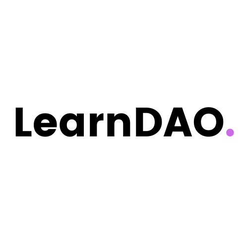

<div id="top"></div>

[![Contributors][contributors-shield]][contributors-url]
[![Forks][forks-shield]][forks-url]
[![Stargazers][stars-shield]][stars-url]
[![Issues][issues-shield]][issues-url]
[![MIT License][license-shield]][license-url]
[![LinkedIn][linkedin-shield]][linkedin-url]

<!-- PROJECT LOGO -->
<br />
<div align="center">

  <h3 align="center">LearnDAO</h3>
  

  <p align="center">
    A DAO to build a better internet, together
    <br />
    <a href="http://learn-dao.xyz/"><strong>Take me to the Website »</strong></a>
    <br />
    <br />
    <a href="https://github.com/Learn-DAO/LearnDAO/issues">Report Bug</a>
    ·
    <a href="https://github.com/Learn-DAO/LearnDAO/issues">Request Feature</a>
  </p>
</div>

<!-- TABLE OF CONTENTS -->
<details>
  <summary>Table of Contents</summary>
  <ol>
    <li>
      <a href="#about-the-project">About The Project</a>
      <ul>
        <li><a href="#built-with">Built With</a></li>
      </ul>
    </li>
    <li>
      <a href="#getting-started">Getting Started</a>
      <ul>
        <li><a href="#prerequisites">Prerequisites</a></li>
        <li><a href="#installation">Installation</a></li>
      </ul>
    </li>
    <li><a href="#usage">Usage</a></li>
    <li><a href="#contributing">Contributing</a></li>
    <li><a href="#license">License</a></li>
    <li><a href="#contact">Contact</a></li>
    <li><a href="#acknowledgments">Acknowledgments</a></li>
  </ol>
</details>

<!-- ABOUT THE PROJECT -->
## About The Project

[![Poster Image][product-screenshot]](https://learn-dao.xyz/)

This is a project is a part of Road to Web3 - ETHGlobal Hackathon. Learn DAO is a community to build a better internet, together. Its mission is to help builders create the future of the Web. We plan to execute that mission by building a learning platform. DAO members will be able to propose tutorial guides and get feedback before publishing them.

Writers and reviewers will be rewarded for the content they produce. And anyone with an internet connection will be able to access the guides and collaborate with other members to build.

This is a huge problem space and we fully expect Learn DAO to grow its membership, partner with others and inspire more solutions. For instance, there’s a need for better documentation and Q&A databases. Maybe the community will vote to build a product that addresses one of these.

The opportunities are endless. We want to lower the activation energy to pursue them.

<p align="right">(<a href="#top">back to top</a>)</p>

### Built With

- [NextJS](https://nextjs.org/)
- [Moralis](https://moralis.io/)
- [Polygon](https://polygon.technology/)
- [TailwindCSS](https://tailwindcss.com/)
- [OpenZeppelin Governor](https://blog.openzeppelin.com/governor-smart-contract/)
- [Typescript](https://www.typescriptlang.org/)
- [Hardhat](https://hardhat.org/)
- [Love ❤️](https://c.tenor.com/U45Q8YaJzBUAAAAC/moti-hearts.gif)

<p align="right">(<a href="#top">back to top</a>)</p>

<!-- GETTING STARTED -->
## Getting Started

To get a local copy up and running follow these simple steps.

### Prerequisites

- Nodejs (14.x or higher)
- yarn

  ```sh
  npm install --global yarn
  ```

### Installation

1. Clone the repo

   ```sh
   git clone https://github.com/Learn-DAO/LearnDAO
   ```

2. Install NPM packages

   ```sh
   yarn
   ```

<p align="right">(<a href="#top">back to top</a>)</p>

<!-- USAGE EXAMPLES -->
## Usage

1. Start the Server

   ```sh
   yarn dev
   ```

2. Contracts addresses can be found [here](https://github.com/Learn-DAO/LearnDAO/blob/main/utils/constants.ts).

<p align="right">(<a href="#top">back to top</a>)</p>

<!-- CONTRIBUTING -->
## Contributing

Contributions are what make the open source community such an amazing place to learn, inspire, and create. Any contributions you make are **greatly appreciated**.

If you have a suggestion that would make this better, please fork the repo and create a pull request. You can also simply open an issue with the tag "enhancement".
Don't forget to give the project a star! Thanks again!

1. Fork the Project
2. Create your Feature Branch (`git checkout -b feature/AmazingFeature`)
3. Commit your Changes (`git commit -m 'Add some AmazingFeature'`)
4. Push to the Branch (`git push origin feature/AmazingFeature`)
5. Open a Pull Request

<p align="right">(<a href="#top">back to top</a>)</p>

<!-- LICENSE -->
## License

Distributed under the MIT License. See `LICENSE.txt` for more information.

<p align="right">(<a href="#top">back to top</a>)</p>

<!-- CONTACT -->
## Contact

Viral Sangani - [@viral_sangani](https://twitter.com/viral_sangani_) - viral.sangani2011@gmail.com

Project Link: [https://github.com/Learn-DAO/LearnDAO](https://github.com/Learn-DAO/LearnDAO)

<p align="right">(<a href="#top">back to top</a>)</p>

<!-- ACKNOWLEDGMENTS -->
## Acknowledgments

List of resources I find helpful and would like to give credit to.

- [Moralis Docs](https://docs.moralis.io/introduction/readme)
- [OpenZeppelin Governor Docs](https://docs.openzeppelin.com/contracts/4.x/api/governance)

<p align="right">(<a href="#top">back to top</a>)</p>

<!-- MARKDOWN LINKS & IMAGES -->
<!-- https://www.markdownguide.org/basic-syntax/#reference-style-links -->
[contributors-shield]: https://img.shields.io/github/contributors/Learn-DAO/LearnDAO.svg?style=for-the-badge
[contributors-url]: https://github.com/Learn-DAO/LearnDAO/graphs/contributors
[forks-shield]: https://img.shields.io/github/forks/Learn-DAO/LearnDAO.svg?style=for-the-badge
[forks-url]: https://github.com/Learn-DAO/LearnDAO/network/members
[stars-shield]: https://img.shields.io/github/stars/Learn-DAO/LearnDAO.svg?style=for-the-badge
[stars-url]: https://github.com/Learn-DAO/LearnDAO/stargazers
[issues-shield]: https://img.shields.io/github/issues/Learn-DAO/LearnDAO.svg?style=for-the-badge
[issues-url]: https://github.com/Learn-DAO/LearnDAO/issues
[license-shield]: https://img.shields.io/github/license/Learn-DAO/LearnDAO.svg?style=for-the-badge
[license-url]: https://github.com/Learn-DAO/LearnDAO/blob/main/LICENSE.txt
[linkedin-shield]: https://img.shields.io/badge/-LinkedIn-black.svg?style=for-the-badge&logo=linkedin&colorB=555
[linkedin-url]: https://www.linkedin.com/in/viral-sangani/
[product-screenshot]: assets/learn-dao-banner.png
